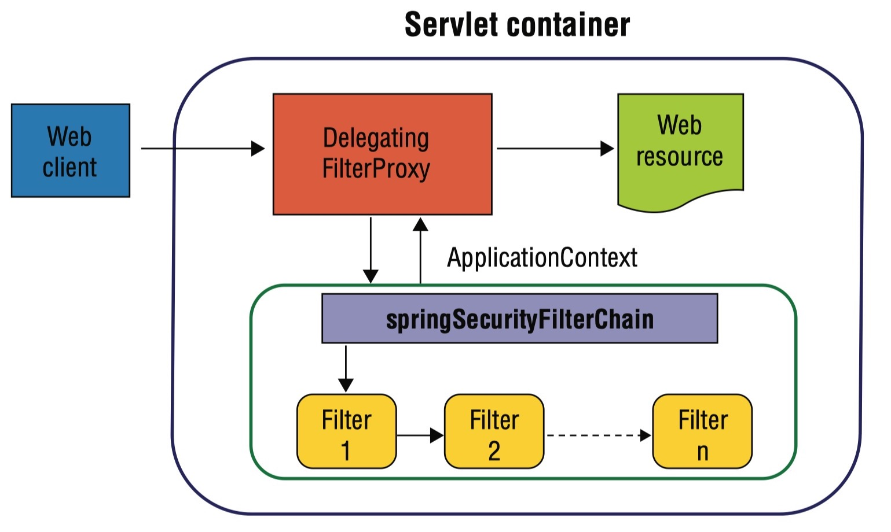

# Spring Security

In Spring Boot applications, all the incoming requests first come to the `DispatcherServlet` which acts like a **front controller**, it then forwards the request to the respective RestController.

Security should be implemented even before the request comes to the DispatcherServlet.

This is achieved by using various `Filters`.

Now these Filters are provided by Spring Security so that we don't have to configure multiple filters on our application.

Instead of having various filters on our end, we just use one filter provided by Spring Security i.e. `DelegatingFilterProxy`.

We map all the incoming requests to the `DFP` and `DFP` delegates the call to `FilterChainProxy` which in turn delegates to the chain of filters.

There can be multiple filter chains as well.

#### What is the need of multiple filter chains?

Suppose we want to have three types of authentication mechanisms implemented in our application: Google, Facebook and GitHub.
For each type of auth, there will be a different filter chain.

### What is the security filter chain?

1. The DelegatingFilterProxy delegates to `springSecurityFilterChain` which is a `FilterChainProxy`.

2. The `FilterChainProxy` contains all the security logic arranged internally as a chain (or chains) of filters.

3. Under the hood of `springSecurityFilterChain`, in a secured web environment the secured requests are handled by a chain of Spring-managed beans, which is why the proxy bean is named `springSecurityFilterChain`, because those filters are chained.

This chain of filters has the following key responsibilities:

- driving authentication
- enforcing authorization
- managing logout
- maintaining SecurityContext in HttpSession
